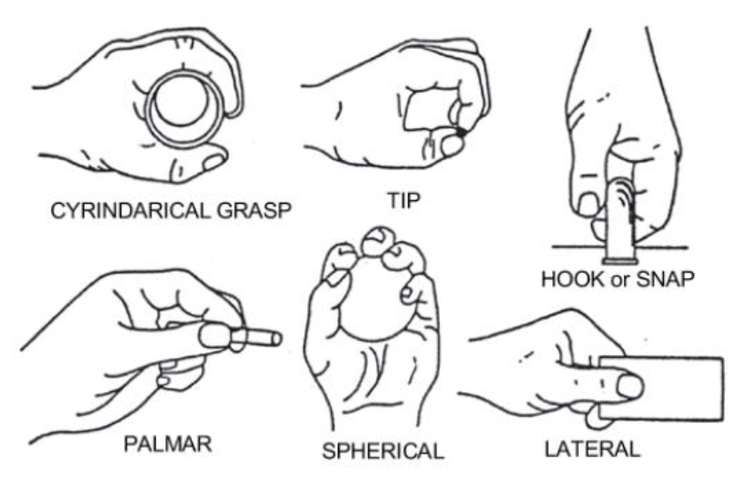

# sEMG Signal Neural Network Classifier

Electromyography is the study of electrical signals from skeletal muscles. These signals (sEMG signals) differ based on muscle movement and can be captured with specialized peripherals. This project is an attempt to construct and train a neural network to interpret the raw composite signal data, and classify the sequence data as one of the following grips:

Languages and frameworks used:
- [Jupyter Notebook](https://jupyter.org/)
- [Tensorflow](https://www.tensorflow.org/)

Models were deployed to [Paperspace](https://www.paperspace.com/) for training and hyperparameter tuning.
